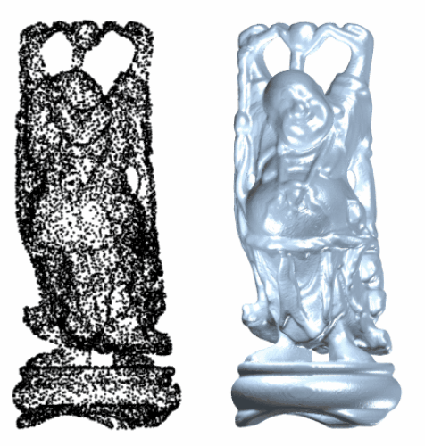
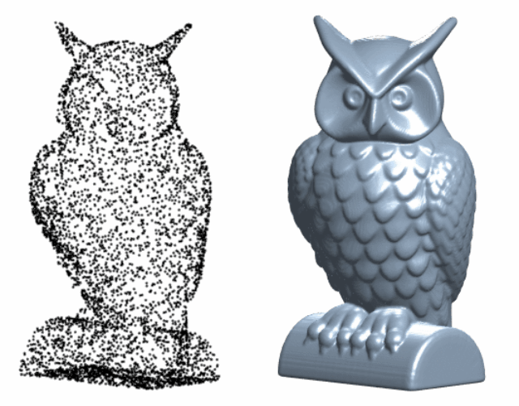

<div align="center">

## On the numerical approximation of a phase-field volume reconstruction model: Linear and energy-stable leap-frog finite difference scheme

[](https://doi.org/10.1016/j.cnsns.2025.109104)

**Boyi Fu, Dongting Cai, Xiangjie Kong, Renjun Gao, Junxiang Yang**

</div>

---

<p align="center">
  
  
</p>

> B. Fu, D. Cai, X. Kong, R. Gao, and J. Yang. On the numerical approximation of a phase-field volume reconstruction model: Linear and energy-stable leap-frog finite difference scheme. Communications in Nonlinear Science and Numerical Simulation, vol. 151, Article 109104, 2025.

This repository contains the finite-difference implementation and minimal inspection utilities for the phase-field volume reconstruction model studied in the paper.

For additional data, please contact: boyifu101@gmail.com.

## What Is Included

- C implementation of the linear energy-stable Leap-frog finite-difference solver.
- C utility for L2 accuracy calculations from generated `phi*.m` outputs.
- Python utility for preparing point-cloud inputs for the finite-difference grid code.
- MATLAB scripts for static volume and point-cloud inspection.
- README GIF assets showing point-cloud inputs and reconstructed volumes.

Large point-cloud datasets and generated `phi*.m` result files are not included.

## Build

With GCC or MinGW:

```bash
gcc -O2 -std=gnu99 -Wall -Wextra src/leapfrog.c -lm -o leapfrog
gcc -O2 -std=gnu99 -Wall -Wextra src/accuracy.c -lm -o accuracy
```

The code is written for C99-compatible compilers. `gnu99` is used in the Makefile because older MinGW versions handle it more consistently.

## Run The Solver

The solver needs two text inputs:

- `nt_points.m`: one number, the number of point-cloud samples.
- `fun_data.m`: x, y, z coordinates written one value per line.

Example:

```bash
./leapfrog --nt-points examples/teapot/nt_points.m --points examples/teapot/fun_data.m --output-dir output
```

On Windows PowerShell after compiling with MinGW:

```powershell
.\leapfrog.exe --nt-points examples\teapot\nt_points.m --points examples\teapot\fun_data.m --output-dir output
```

To write only the energy history and skip large volume outputs:

```bash
./leapfrog --nt-points examples/teapot/nt_points.m --points examples/teapot/fun_data.m --output-dir output --no-phi
```

The default grid size is `128 x 128 x 128`. You can override it at compile time:

```bash
gcc -O2 -std=gnu99 -Wall -Wextra -Dgnx=64 -Dgny=64 -Dgnz=64 src/leapfrog.c -lm -o leapfrog
```

## Prepare Point-Cloud Data

Convert plain text point-cloud samples to solver-ready files:

```bash
python preprocessing/prepare_point_cloud.py --input points.txt --output-dir examples/teapot --normalize --scale 0.8
```

The output folder contains:

```text
examples/teapot/nt_points.m
examples/teapot/fun_data.m
```

## Inspect Results

Render a reconstructed volume in MATLAB:

```matlab
render_volume('output/phi3.m', [128 128 128], [1 1 1], 0, [-122 45])
```

Render input point-cloud samples:

```matlab
render_pointcloud('examples/teapot/fun_data.m', 27, 2.7, [-122 45])
```

## Repository Structure

```text
src/              C solver and accuracy utility
preprocessing/    point-cloud input preparation
matlab/           static inspection utilities
assets/           README GIF assets
docs/             implementation notes
```

## Citation

If you use this code, please cite the associated paper.

BibTeX:

```bibtex
@article{fu2025Leapfrog3DR,
  title   = {On the numerical approximation of a phase-field volume reconstruction model: Linear and energy-stable leap-frog finite difference scheme},
  author  = {Fu, B. and Cai, D. and Kong, X. and Gao, R. and Yang, J.},
  journal = {Communications in Nonlinear Science and Numerical Simulation},
  volume  = {151},
  pages   = {109104},
  year    = {2025},
  doi     = {10.1016/j.cnsns.2025.109104}
}
```

## Notes

See `docs/IMPLEMENTATION_NOTES.md` for what was changed from the original working directory and what still needs manual paper-level verification before final publication.

This repository is released under the MIT License.
